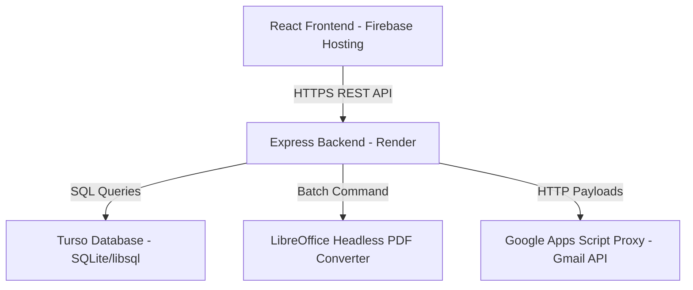

# Trinity College R&D Cell - Bulk Certificate Dispatch & Application Management System

A high-performance web application designed to manage club applications and execute bulk certificate generation/dispatch for events. The system automatically converts PowerPoint (`.pptx`) templates into personalized PDFs using headless LibreOffice, replaces template placeholders dynamically per-recipient, and dispatches them via email using a Google Apps Script HTTP proxy to bypass Render's SMTP port blocks.

---

## 🏗️ System Architecture & Stack

The application splits into a classic client-server model:



### Frontend
- **Framework**: Vite + React + TypeScript
- **Styling**: Modern, premium custom Vanilla CSS (dark/light themes, card layouts, responsive sidebar dashboard)
- **State & Routing**: React Router DOM & React Hooks
- **Hosting**: Firebase Hosting (`https://tcek-rd.web.app`)

### Backend
- **Framework**: Node.js + Express + TypeScript (`tsc`)
- **Database**: Turso DB (SQLite/libsql) for lightning-fast edge query performance.
- **Certificate Engine**: Custom XML parser modifying PowerPoint `.pptx` slides dynamically.
- **Conversion Engine**: Headless LibreOffice running inside a custom Dockerized container on Render to convert slides to PDFs in batch commands.
- **Email Delivery Proxy**: Google Apps Script Proxy that forwards payloads over port 443 via standard HTTP POST, bypassing SMTP/port blocks on Render's free tier.

---

## ✨ Features

### 1. Dynamic Certificate Actions & Text Dropdowns
- **Per-Student Action Text**: Instead of global configurations, admins specify individual actions for each attendee directly in the table row dropdown.
- **Casing Normalization**: Automatic case-insensitive matching between database status values and dropdown selections (e.g. `'won Second Place'` displays as `"Won Second Place"`).
- **Template Resolution**: The system automatically determines which PowerPoint template to use:
  - If action matches `"Participation"`, `"participation"`, or `"participated"`, it loads the **Participation Template**.
  - Any other custom action (e.g. `"Appreciation"`, `"Coordinated"`, `"Won First Place"`) triggers the **Appreciation Template** and replaces the `{{CERTIFICATE TYPE}}` placeholder with the exact action string.

### 2. Status Badge Indicators & Modification Guard
- **Achievement Status Badges**: Pill badges render dynamically next to each student's name indicating their action (e.g. `Won Second Place` in purple or `Participation` in blue).
- **Modification Guard**: Once a certificate has been successfully dispatched (status `Sented`), the action select dropdown becomes **disabled** (renders greyed out with a `not-allowed` cursor) to prevent accidental post-dispatch changes.
- **Sented / Pending Status Badge**: Small green `Sented` or amber `Pending` badges render next to the student's name showing dispatch success.

### 3. Event Registrations Status Filtering
- Filter list items by Certificate status:
  - **All Certificates**
  - **Sented Only**
  - **Pending Only**

### 4. Headless PPTX-to-PDF Conversion
- Runs batch conversion through LibreOffice CLI, converting dozens of PPTX files to PDF concurrently inside the container in less than 2 seconds (vs 15 seconds sequentially).

### 5. Automated Text Auto-Scaling
- Automatically detects event title length and scales down font sizes to prevent line-wrapping or overlapping placeholders on certificates.

---

## 📁 File Structure

```bash
├── .firebase/                  # Firebase Hosting cache files
├── backend/                    # Node.js + Express backend service
│   ├── src/
│   │   ├── index.ts            # Main entry point: REST API routes, DB migrations, and dispatch engines
│   │   ├── types.ts            # Common TS interface declarations
│   ├── .env                    # Local environment variables
│   ├── Dockerfile              # Docker build file containing headless LibreOffice setup
│   ├── package.json            # Node dependencies and build scripts
│   └── tsconfig.json           # TypeScript configuration
├── frontend/                   # Vite + React frontend application
│   ├── src/
│   │   ├── components/         # Shared presentation elements (Navbar, Contact, etc.)
│   │   ├── pages/
│   │   │   ├── AdminDashboardPage.tsx  # Central dashboard layout for club and event lists
│   │   │   ├── AdminLoginPage.tsx      # Admin authentication page
│   │   │   ├── ApplyPage.tsx           # Public club recruitment application form
│   │   │   ├── ResearchPage.tsx        # Public event registration / student form
│   │   ├── App.tsx             # Application router
│   │   ├── index.css           # Global stylesheet containing variables and responsive grids
│   │   └── main.tsx            # React bootstrap entry point
│   ├── vite.config.ts          # Vite build config
│   └── package.json            # Node dependencies
├── CERTIFICATE_TEMPLATE.pptx   # Master slide for participation certificates
├── CERTIFICATE_TEMPLATE - APPRECIATION.pptx # Master slide for appreciation certificates
├── firebase.json               # Firebase deployment setup
└── README.md                   # Project documentation
```

---

## 🚀 Local Development

### 1. Backend Setup
1. Open a terminal and navigate to the backend directory:
   ```bash
   cd backend
   ```
2. Install dependencies:
   ```bash
   npm install
   ```
3. Set up environment variables in `backend/.env`:
   ```ini
   PORT=5000
   TURSO_URL=your_turso_db_url
   TURSO_TOKEN=your_turso_auth_token
   JWT_SECRET=your_jwt_secret_key
   SENDER_EMAIL=your_email@gmail.com
   SENDER_PASSWORD=your_gmail_app_password
   GMAIL_HTTP_PROXY_URL=your_google_apps_script_url
   ```
4. Start the backend developer server:
   ```bash
   npm run dev
   ```

### 2. Frontend Setup
1. Open a new terminal and navigate to the frontend directory:
   ```bash
   cd frontend
   ```
2. Install dependencies:
   ```bash
   npm install
   ```
3. Start the Vite developer server:
   ```bash
   npm run dev
   ```
4. Open your browser and navigate to `http://localhost:5173/`.

---

## ⚙️ How to Use

### 👥 Public Registrations & Recruitment
- Students register for events via the **Event Registration Page** (`/register`).
- Students apply to join the cell core team via the **Recruitment Application Page** (`/apply`).

### 🔑 Accessing the Admin Console
1. Navigate to `/admin/login`.
2. Login using the admin credentials (automatically seeded to the database during startup).
3. The dashboard is divided into two tabs:
   - **Club Applications**: View and manage candidate recruitment records.
   - **Event Registrations**: View and filter event attendance and certificate dispatches.

### 📜 Modifying & Sending Certificates
1. Navigate to **Event Registrations**.
2. Select a specific event from the filter dropdown (bulk operations require selecting a specific event).
3. Use the dropdown in the student row to change their achievement status (e.g. `Participation`, `Won First Place`, `Coordinated`).
4. Click **Send Certificates** at the top.
5. Confirm the action in the popup modal. The console drawer will expand at the bottom of the screen, printing real-time stream logs as certificates are compiled, converted to PDF, and dispatched.
6. Once complete, the student's status badge will update to a green `Sented` label, and their dropdown will lock.

---

## 📦 Deployment

### Frontend (Firebase Hosting)
To bundle the frontend resources and upload them to Firebase:
```bash
cd frontend
npm run build
npx firebase deploy --only hosting
```

### Backend (Render Container)
The backend requires a Linux container with LibreOffice installed. Deployments are automated: pushing commits to the GitHub repository's `master` branch triggers Render to fetch, build, and run the `Dockerfile`:
```bash
git add .
git commit -m "Deploy latest changes"
git push origin master
```

---

## 🧹 Clearing Database for Testing

To clear all test applications and event registrations from the Turso database, you can run the database clearing script.

Create a file named `clear_db.js` in the `backend` folder with the following content:

```javascript
const { createClient } = require('@libsql/client');
require('dotenv').config();

const tursoUrl = process.env.TURSO_URL;
const tursoToken = process.env.TURSO_TOKEN;

if (!tursoUrl || !tursoToken) {
  console.error("CRITICAL: TURSO_URL and TURSO_TOKEN must be configured in .env file.");
  process.exit(1);
}

const db = createClient({
  url: tursoUrl,
  authToken: tursoToken,
});

async function run() {
  try {
    console.log("Clearing club applications...");
    await db.execute("DELETE FROM club_applications;");
    console.log("Clearing event registrations...");
    await db.execute("DELETE FROM event_registrations;");
    console.log("Database tables cleared successfully!");
  } catch (error) {
    console.error("Error clearing database:", error);
  }
}

run();
```

To run the script and clear the tables:
```bash
cd backend
node clear_db.js
```
